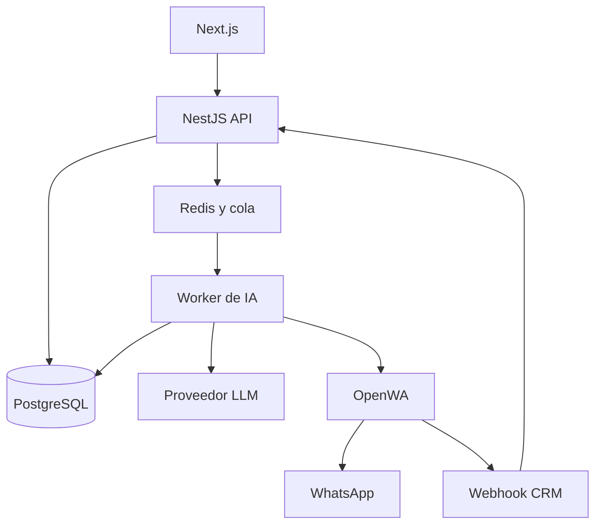

# Especificación Funcional y Técnica — CRM Multiagente con IA y OpenWA

> Documento maestro de producto, arquitectura e implementación para una demo de agencia inmobiliaria.

**Versión:** 1.1  
**Fecha:** 18 de agosto de 2026  
**Estado:** Scope confirmado para implementación  
**Caso inicial:** Agencia inmobiliaria  
**Extensión prevista:** Agencias de viajes  
**Pasarela de WhatsApp:** [rmyndharis/OpenWA](https://github.com/rmyndharis/OpenWA)

---

## 1. Propósito del documento

Este documento define un CRM multi-tenant en el que una organización puede crear varios agentes de atención, conectar varias sesiones o números de WhatsApp y asignar una sesión a cada agente. Los agentes representan integrantes del equipo comercial y pueden responder automáticamente mediante un modelo de lenguaje usando la información de propiedades almacenada en el CRM.

La primera entrega será una demo funcional para una agencia inmobiliaria. La arquitectura debe permitir agregar posteriormente agencias de viajes sin reconstruir el núcleo de mensajería, usuarios, conversaciones ni automatización.

Este archivo debe considerarse la fuente principal de requisitos para un agente de desarrollo de IA. Si una decisión de implementación no aparece definida, debe elegirse la alternativa más sencilla que preserve seguridad, aislamiento multi-tenant, trazabilidad y extensibilidad.

---

## 2. Stack tecnológico confirmado

La solución se implementará como un monorepo TypeScript con servicios desplegables de manera independiente:

| Capa | Tecnología | Responsabilidad |
| --- | --- | --- |
| Frontend | Next.js + TypeScript | Dashboard SaaS, invitaciones, agentes, sesiones, conversaciones, propiedades, calendarios y administración. |
| Backend | NestJS + TypeScript | API, autenticación, autorización, multi-tenancy, webhooks, integraciones y lógica de negocio. |
| Base de datos | PostgreSQL | Fuente de verdad del CRM. |
| ORM | Prisma | Esquema, migraciones y acceso tipado. |
| Cola y locks | Redis + BullMQ | IA, sincronizaciones, envíos, reintentos y procesamiento secuencial. |
| Tiempo real | WebSockets | Conversaciones, QR, estados y notificaciones. |
| WhatsApp | OpenWA | Administración de múltiples sesiones y transporte de mensajes. |
| IA | Adaptadores TypeScript multi-LLM | Proveedores y modelos habilitados por el superadministrador. |
| Calendarios | Google Calendar API | Calendario personal del asesor y compartido de la agencia. |
| Archivos | S3 o MinIO | Imágenes, documentos, importaciones y medios. |
| Infraestructura | Dokploy | Despliegue y operación. |

El núcleo del backend no se implementará solamente con Route Handlers de Next.js. NestJS será responsable de procesos de larga duración, webhooks, workers, autorización e integraciones; Next.js consumirá su API.

## 3. Visión del producto

Una agencia inmobiliaria recibe más conversaciones de WhatsApp de las que su equipo puede atender manualmente. El CRM permitirá que la agencia:

1. Cree una cuenta y un espacio de trabajo propio.
2. Registre a los miembros humanos de su equipo.
3. Cree varios agentes de atención con personalidad, reglas y objetivos propios.
4. Conecte varios números de WhatsApp mediante OpenWA.
5. Asigne una sesión de WhatsApp a cada agente.
6. Active o desactive la respuesta automática por agente, conversación o sesión.
7. Permita que el agente de IA consulte el inventario real de propiedades.
8. Califique al prospecto, recomiende propiedades y capture datos de interés.
9. Transfiera una conversación a un asesor humano cuando corresponda.
10. Mantenga el historial, el estado del lead y la auditoría de todas las acciones.

El producto no es solamente un chatbot. Es un CRM conversacional que combina inventario, leads, sesiones de WhatsApp, agentes de IA y atención humana.

---

## 4. Definiciones del dominio

Para evitar ambigüedades, se usarán estos términos:

| Término | Definición |
| --- | --- |
| Organización o tenant | Cuenta aislada de una agencia. En la demo será una agencia inmobiliaria. |
| Usuario humano | Persona que inicia sesión en el CRM: propietario, administrador, supervisor o asesor. |
| Agente | Representación digital de un asesor humano real. Tiene identidad, reglas, configuración de IA y una sesión asignada. Puede operar con IA, humano o modo híbrido. |
| Sesión de WhatsApp | Conexión entre OpenWA y un número de WhatsApp. Se crea y autentica con QR o el mecanismo que soporte el motor seleccionado. |
| Número o canal | Número asociado a una sesión de WhatsApp. Para el MVP existe una relación uno a uno entre sesión activa y número. |
| Lead | Prospecto identificado normalmente por su teléfono dentro de una organización. |
| Conversación | Hilo entre un lead y una sesión/agente de la organización. |
| Mensaje | Evento entrante o saliente perteneciente a una conversación. |
| Agente de IA | Motor que decide y redacta respuestas usando instrucciones, historial y herramientas del CRM. No es la sesión de WhatsApp. |
| Handoff | Transferencia de una conversación desde la automatización hacia un usuario humano. |

### 4.1 Relaciones confirmadas

- Cada agente representa a un asesor humano real y debe tener un `responsible_user_id`.
- En la primera versión, un asesor puede tener como máximo un agente activo.
- Un agente puede tener **cero o una sesión activa asignada**.
- Una sesión puede estar asignada a **cero o un agente**.
- La relación es uno a uno mientras la asignación esté activa.
- Una organización puede tener muchos agentes y muchas sesiones.
- Una sesión sin agente puede conectarse y probarse, pero no responderá automáticamente.
- El historial permanece asociado a la sesión y conversación aunque se cambie el agente asignado.
- Los cambios de asignación deben quedar registrados en auditoría.

Esta regla puede evolucionar después hacia colas o equipos que compartan un número, pero no forma parte de la demo.

---

## 5. Alcance de la versión 1 inmobiliaria

### 5.1 Incluido

- SaaS multiagencia desde la primera versión.
- Consola de superadministración.
- Creación de agencias solamente mediante invitación del superadministrador.
- Inicio de sesión y aceptación de invitaciones.
- Roles básicos y miembros del equipo.
- CRUD de agentes.
- CRUD y ciclo de conexión de sesiones OpenWA.
- Visualización y actualización del QR.
- Asignación agente ↔ sesión.
- Configuración de identidad, instrucciones y estado de automatización por agente.
- CRUD de propiedades inmobiliarias.
- Importación mediante CSV o Excel.
- Sincronización mediante API externa, feed XML/JSON y Google Sheets.
- Recepción de mensajes por webhook.
- Bandeja de conversaciones.
- Historial de mensajes.
- Respuestas automáticas con LLM.
- Búsqueda estructurada de propiedades mediante herramientas internas.
- Recomendación de propiedades con datos reales.
- Captura y actualización del perfil de interés del lead.
- Calificación básica del lead.
- Pausa de IA y atención humana.
- Handoff automático y manual.
- Envío manual de mensajes desde el CRM.
- Estados de sesión, mensajes y errores.
- Calendario interno y visitas.
- Sincronización con Google Calendar personal y compartido.
- Dashboard, auditoría y métricas operativas.

### 5.2 Fuera del alcance inicial

- Campañas masivas o prospección en frío.
- Facturación, pagos y suscripciones SaaS.
- Aplicación de límites comerciales; el modelo quedará preparado, pero sin restricciones activas.
- Aplicación móvil nativa.
- Integración completa con portales inmobiliarios.
- Firma de contratos y procesos notariales.
- Pagos, hipotecas o validación crediticia.
- Omnicanalidad con Instagram, Facebook o correo.
- Analítica avanzada o entrenamiento de modelos propios.
- Automatizaciones complejas de n8n como requisito del núcleo.
- Caso completo de agencia de viajes; solamente se dejarán extensiones de dominio.

---

## 6. Personas, roles y permisos

### 6.1 Roles humanos

| Rol | Capacidades principales |
| --- | --- |
| `SUPER_ADMIN` | Crea e invita agencias, administra proveedores LLM y supervisa infraestructura, consumo y estado global. No pertenece a un tenant ordinario. |
| `OWNER` | Control total, organización, miembros, sesiones, agentes, configuración y borrado. |
| `ADMIN` | Gestiona miembros, agentes, sesiones, propiedades y conversaciones; no elimina la organización. |
| `SUPERVISOR` | Ve todas las conversaciones, reasigna, toma control, revisa métricas y configura agentes si recibe permiso. |
| `ADVISOR` | Atiende las conversaciones asignadas, consulta propiedades y actualiza leads. |

Los permisos deben verificarse en el backend. Ocultar botones en el frontend no sustituye la autorización.

### 6.2 Alta de agencias

No existirá registro público en la primera versión:

1. El superadministrador crea la organización.
2. Captura nombre, industria, zona horaria y correo del propietario.
3. El sistema envía una invitación de un solo uso y con expiración.
4. El propietario define su acceso y completa el perfil de la agencia.
5. El propietario puede invitar al resto de su equipo.
6. El superadministrador puede suspender la organización sin eliminar sus datos.

### 6.3 Modos operativos de un agente

| Modo | Comportamiento |
| --- | --- |
| `AI` | La IA responde automáticamente mientras no exista pausa ni handoff. |
| `HUMAN` | Solo un usuario humano puede responder. |
| `HYBRID` | La IA responde por defecto y transfiere cuando detecta una regla de escalamiento o un humano toma la conversación. |

La demo debe usar `HYBRID` como modo recomendado.

---

## 7. Historias de usuario prioritarias

### 7.1 Superadministrador

- Como superadministrador quiero crear agencias e invitar a su propietario.
- Como superadministrador quiero activar o suspender una organización.
- Como superadministrador quiero configurar proveedores, credenciales y modelos LLM globales.
- Como superadministrador quiero revisar consumo, errores, sesiones y salud del sistema.
- Como superadministrador quiero dejar preparados límites futuros sin aplicarlos todavía.

### 7.2 Propietario o administrador

- Como administrador quiero crear varios agentes para representar a los integrantes del equipo.
- Como administrador quiero conectar un número distinto para cada agente.
- Como administrador quiero ver el QR y el estado de conexión sin ingresar a OpenWA.
- Como administrador quiero asignar o reemplazar la sesión de un agente.
- Como administrador quiero definir nombre, tono, saludo, reglas y horario del agente.
- Como administrador quiero activar o pausar la IA sin desconectar el número.
- Como administrador quiero registrar propiedades para que la IA solo ofrezca inventario real.
- Como administrador quiero revisar conversaciones y tomar el control cuando sea necesario.

### 7.3 Asesor humano

- Como asesor quiero ver las conversaciones relacionadas con mi agente o las que me asignaron.
- Como asesor quiero saber si está respondiendo la IA o una persona.
- Como asesor quiero pausar la IA, responder y devolver el control cuando termine.
- Como asesor quiero responder desde el CRM o desde mi teléfono sin que la IA responda simultáneamente.
- Como asesor quiero consultar las propiedades recomendadas y el resumen del lead.

### 7.4 Prospecto

- Como prospecto quiero recibir respuestas rápidas y naturales.
- Como prospecto quiero explicar presupuesto, zona, tipo de operación y características deseadas.
- Como prospecto quiero recibir opciones reales y enlaces verificables.
- Como prospecto quiero solicitar atención humana o programar una visita.
- Como prospecto quiero que no me inventen precios, disponibilidad ni características.

---

## 8. Flujos funcionales

### 8.1 Crear un agente

1. El administrador abre **Agentes → Nuevo agente**.
2. Captura nombre visible, descripción, modo, idioma, tono, saludo, instrucciones y reglas de escalamiento.
3. Asigna obligatoriamente un asesor humano que no tenga otro agente activo.
4. Guarda el agente en estado `DRAFT` o `ACTIVE`.
5. Si no tiene sesión asignada, el sistema muestra `Sin canal conectado`.

### 8.2 Conectar una sesión de WhatsApp

1. El administrador abre **WhatsApp → Nueva sesión**.
2. Asigna un nombre interno y selecciona el motor de OpenWA si la instalación lo permite.
3. El backend crea primero el registro local en estado `CREATING`.
4. El backend crea la sesión en OpenWA.
5. El backend solicita iniciar la sesión.
6. La interfaz consulta u obtiene el QR y lo muestra.
7. El usuario escanea el QR desde WhatsApp.
8. OpenWA emite el cambio de estado.
9. El CRM marca la sesión como `CONNECTED`, obtiene los metadatos disponibles y muestra el número vinculado.
10. El administrador puede asignarla a un agente.

### 8.3 Asignar sesión a un agente

1. El administrador selecciona un agente y una sesión conectada no asignada.
2. El backend valida que ambos pertenezcan al mismo tenant.
3. Verifica la unicidad de la relación activa.
4. Crea el registro de asignación y registra el cambio en auditoría.
5. El agente puede responder automáticamente si está activo y su automatización está habilitada.

### 8.4 Procesar un mensaje entrante

1. OpenWA entrega un evento `message.received` al webhook del CRM.
2. El CRM verifica firma, timestamp y cuerpo sin modificar.
3. Identifica la sesión OpenWA y la organización.
4. Descarta eventos duplicados por identificador del proveedor.
5. Separa mensajes del lead de mensajes `fromMe`; estos últimos siguen el flujo de takeover desde teléfono.
6. Normaliza teléfono, chat, texto, tipo, adjuntos y timestamps.
7. Busca o crea el lead y la conversación.
8. Guarda el mensaje entrante.
9. Responde `2xx` rápidamente a OpenWA.
10. Publica un trabajo en una cola con clave por conversación.
11. El worker determina si la IA puede responder.
12. Compila instrucciones, historial resumido y datos relevantes.
13. El LLM usa herramientas internas para buscar propiedades o actualizar el lead.
14. Valida la respuesta y aplica reglas de seguridad.
15. Envía el mensaje con la sesión correcta.
16. Guarda la respuesta, uso del modelo y estado de entrega.

### 8.5 Tomar control humano desde el CRM

1. Un usuario autorizado presiona **Tomar conversación**.
2. El estado cambia a `HUMAN_ACTIVE`.
3. Los trabajos pendientes de IA se cancelan si todavía no enviaron mensaje.
4. Los mensajes nuevos se guardan y notifican, pero la IA no responde.
5. El humano responde desde el CRM usando la misma sesión.
6. Cuando selecciona **Devolver a IA**, el estado cambia a `AI_ACTIVE` y se añade una nota de sistema al contexto.

### 8.6 Responder desde el teléfono

1. El asesor envía un mensaje desde la aplicación de WhatsApp del número vinculado.
2. OpenWA emite el evento con indicador `fromMe`.
3. El CRM identifica sesión, conversación y agente.
4. Guarda el mensaje como `OUTBOUND`, `HUMAN` y origen `WHATSAPP_PHONE`.
5. Cancela cualquier generación automática que todavía no haya sido enviada.
6. Cambia la conversación a `HUMAN_ACTIVE`.
7. La IA permanece pausada sin vencimiento automático.
8. Solo la acción explícita **Devolver a IA** desde el CRM reactiva la automatización.

La misma pausa indefinida se aplica cuando el asesor responde desde el CRM. Los eventos `fromMe` provocados por un envío del propio CRM deben correlacionarse con el mensaje local para evitar duplicados.

### 8.7 Crear y sincronizar una visita

1. La IA o un usuario propone fecha, hora y propiedad.
2. El CRM consulta la disponibilidad interna y los calendarios vinculados.
3. La visita se crea primero en PostgreSQL como fuente de verdad.
4. Un worker crea o actualiza el evento en el Google Calendar personal del asesor.
5. El mismo worker lo refleja en el calendario compartido de la agencia.
6. Se guardan ambos IDs externos y sus versiones de sincronización.
7. Si Google Calendar falla, la visita queda `SYNC_PENDING` y se reintenta.
8. Modificaciones y cancelaciones se propagan evitando bucles y duplicados.

### 8.8 Sesión desconectada

1. OpenWA reporta un estado no operativo o falla un envío.
2. El CRM actualiza el estado y bloquea nuevos envíos automáticos.
3. Se muestra una alerta al administrador.
4. Si se requiere autenticación, se ofrece reconectar y mostrar un QR nuevo.
5. Los mensajes pendientes quedan en error recuperable o se reintentan según la causa.

---

## 9. Arquitectura propuesta



### 9.1 Componentes

#### Frontend

- Next.js con TypeScript.
- Autenticación y selección del workspace.
- Administración de agentes, sesiones, propiedades, leads y equipo.
- Bandeja en tiempo real mediante WebSocket o Server-Sent Events.
- Renderizado seguro de mensajes y adjuntos.
- La clave de OpenWA nunca se entrega al navegador.

#### Backend del CRM

- NestJS con TypeScript como decisión confirmada.
- Prisma como capa tipada de PostgreSQL.
- Responsable de autenticación, autorización y aislamiento multi-tenant.
- Implementa el adaptador OpenWA; el dominio no debe depender directamente de sus DTO.
- Gestiona webhooks, conversaciones, agentes, propiedades, herramientas del LLM y auditoría.

#### Worker de IA

- Procesa mensajes fuera del ciclo HTTP del webhook.
- Serializa trabajos por conversación para conservar el orden.
- Ejecuta herramientas con permisos y validaciones.
- Controla timeout, reintentos y costos.
- Comprueba nuevamente el estado de handoff antes de enviar.

#### OpenWA

- Servicio independiente desplegado en Dokploy.
- Mantiene múltiples sesiones concurrentes.
- Gestiona conexión, QR, mensajes, webhooks y estados.
- Debe ser accesible solo desde servicios autorizados.
- En producción se recomienda PostgreSQL para sus datos y una estrategia de respaldo compatible con su configuración actual.

#### Persistencia y cola

- PostgreSQL como fuente de verdad del CRM.
- Redis para cola, locks, throttling y eventos efímeros.
- El almacenamiento de adjuntos debe ser compatible con S3; la metadata reside en PostgreSQL.

### 9.2 Monorepo recomendado

```text
apps/
  web/                 # Next.js
  api/                 # NestJS REST + WebSockets
  worker/              # NestJS standalone + BullMQ
packages/
  database/            # Prisma schema, client y migraciones
  contracts/           # DTO, schemas y eventos compartidos
  whatsapp-gateway/    # Interfaz y adaptador OpenWA
  ai-gateway/          # Adaptadores de proveedores LLM
  integrations/        # Google Calendar y fuentes de propiedades
  config/              # Configuración tipada
  ui/                  # Componentes compartidos del frontend
```

### 9.3 Límites de responsabilidad

- OpenWA transporta mensajes y mantiene sesiones; no contiene la lógica comercial.
- El CRM decide quién puede responder, qué agente corresponde y qué datos están permitidos.
- El LLM propone respuestas y llamadas a herramientas; no accede directamente a la base de datos.
- Las herramientas del backend validan tenant, argumentos y permisos antes de ejecutar.
- n8n puede usarse para notificaciones o integraciones periféricas, no como fuente de verdad del núcleo.

---

## 10. Integración correcta con OpenWA

La integración se implementará contra la versión fijada de `rmyndharis/OpenWA`. Antes de programar, se debe revisar el Swagger de la instancia desplegada en `/api/docs` y fijar una versión o commit. No se asumirán rutas pertenecientes a otros proyectos llamados OpenWA.

### 10.1 Operaciones REST de referencia

#### Crear sesión

```http
POST /api/sessions
X-API-Key: <OPENWA_API_KEY>
Content-Type: application/json
```

```json
{
  "name": "inmobiliaria-demo-agente-ventas-01"
}
```

El CRM debe guardar el ID devuelto por OpenWA como `provider_session_id`. El nombre humano y el ID del proveedor son campos distintos.

#### Iniciar sesión

```http
POST /api/sessions/{sessionId}/start
X-API-Key: <OPENWA_API_KEY>
```

#### Obtener QR

```http
GET /api/sessions/{sessionId}/qr
X-API-Key: <OPENWA_API_KEY>
```

El adaptador transformará la respuesta real del Swagger en un DTO interno. El frontend no dependerá del formato propio de OpenWA.

#### Enviar texto

```http
POST /api/sessions/{sessionId}/messages/send-text
X-API-Key: <OPENWA_API_KEY>
Content-Type: application/json
```

```json
{
  "chatId": "5214490000000@c.us",
  "text": "Hola, encontré opciones que coinciden con lo que buscas."
}
```

#### Registrar webhook por sesión

```http
POST /api/sessions/{sessionId}/webhooks
X-API-Key: <OPENWA_API_KEY>
Content-Type: application/json
```

```json
{
  "url": "https://crm.example.com/api/v1/integrations/openwa/webhook",
  "events": ["message.received", "session.status"],
  "secret": "<HMAC_SECRET>"
}
```

También deberán evaluarse eventos de estado de mensajes requeridos para actualizar enviado, entregado, leído y fallido. Los nombres exactos se tomarán del OpenAPI de la versión fijada.

### 10.2 Autenticación

- REST: `X-API-Key` o `Authorization: Bearer`, de acuerdo con la configuración del servidor.
- El CRM usará una credencial de servicio almacenada en variables secretas.
- Si OpenWA permite claves restringidas por sesión y rol, deben preferirse sobre una clave administrativa global.
- Nunca registrar claves en logs, respuestas de error o datos de auditoría.

### 10.3 Validación de webhooks

- Conservar el cuerpo crudo para verificar HMAC.
- Rechazar firma inválida.
- Aplicar límite de tamaño.
- Guardar `event_id` o una llave de deduplicación estable.
- Responder rápidamente y procesar mediante cola.
- Aceptar únicamente sesiones previamente registradas.
- Registrar intentos fallidos sin guardar secretos ni contenido excesivo.

### 10.4 Adaptador del proveedor

Crear una interfaz interna similar a:

```ts
interface WhatsAppGateway {
  createSession(input: CreateSessionInput): Promise<ProviderSession>;
  startSession(providerSessionId: string): Promise<void>;
  getQr(providerSessionId: string): Promise<QrResult>;
  getStatus(providerSessionId: string): Promise<ProviderSessionStatus>;
  sendText(input: SendTextInput): Promise<ProviderMessage>;
  sendMedia(input: SendMediaInput): Promise<ProviderMessage>;
  configureWebhook(input: ConfigureWebhookInput): Promise<void>;
  stopSession(providerSessionId: string): Promise<void>;
  deleteSession(providerSessionId: string): Promise<void>;
}
```

`OpenWaGateway` implementará la interfaz. Esto permitirá sustituir el proveedor por WhatsApp Cloud API en el futuro sin reescribir el dominio.

### 10.5 Riesgo de plataforma

Este repositorio se conecta mediante clientes no oficiales (`whatsapp-web.js` o `baileys`) y no mediante la API oficial de Meta. Existe riesgo no eliminable de restricción o bloqueo del número. Para la demo:

- Usar números dedicados y no el número comercial principal.
- Trabajar principalmente con conversaciones iniciadas o consentidas por el lead.
- Evitar campañas y envíos masivos.
- Aplicar límites por sesión.
- Preferir `whatsapp-web.js` si se prioriza reducir riesgo y existe RAM suficiente.
- Considerar que cada sesión con Chromium puede consumir varios cientos de MB de memoria.
- Mantener el adaptador preparado para migrar a la API oficial.

---

## 11. Modelo de datos

Todas las tablas de negocio deben incluir `created_at` y `updated_at`. Las tablas sensibles deben usar borrado lógico cuando sea necesario. Toda consulta multi-tenant debe filtrar por `organization_id`.

### 11.1 `organizations`

| Campo | Tipo | Reglas |
| --- | --- | --- |
| `id` | UUID PK | Generado por servidor. |
| `name` | VARCHAR(150) | Requerido. |
| `slug` | VARCHAR(100) | Único. |
| `industry_type` | ENUM | `REAL_ESTATE`, `TRAVEL`. |
| `timezone` | VARCHAR(50) | Por defecto `America/Mexico_City`. |
| `default_language` | VARCHAR(10) | Por defecto `es-MX`. |
| `status` | ENUM | `ACTIVE`, `SUSPENDED`, `ARCHIVED`. |

### 11.2 `users`

| Campo | Tipo | Reglas |
| --- | --- | --- |
| `id` | UUID PK |  |
| `email` | CITEXT | Único global o según proveedor de identidad. |
| `name` | VARCHAR(120) |  |
| `password_hash` | TEXT | Si no se usa autenticación externa. |
| `status` | ENUM | `INVITED`, `ACTIVE`, `DISABLED`. |

Los superadministradores se identificarán mediante un rol global separado de las membresías de organización. Una cuenta `SUPER_ADMIN` no obtiene acceso implícito al contenido de las conversaciones; cualquier acceso de soporte debe ser explícito y auditado.

### 11.2.1 `organization_invitations`

Incluye `organization_id`, correo, rol, token hasheado, `invited_by_user_id`, fecha de expiración, aceptación, revocación y estado. El token se muestra o envía una sola vez, expira y no puede reutilizarse.

### 11.3 `organization_members`

| Campo | Tipo | Reglas |
| --- | --- | --- |
| `id` | UUID PK |  |
| `organization_id` | UUID FK |  |
| `user_id` | UUID FK |  |
| `role` | ENUM | `OWNER`, `ADMIN`, `SUPERVISOR`, `ADVISOR`. |
| `status` | ENUM | `INVITED`, `ACTIVE`, `DISABLED`. |

Índice único: `(organization_id, user_id)`.

### 11.4 `agents`

| Campo | Tipo | Reglas |
| --- | --- | --- |
| `id` | UUID PK |  |
| `organization_id` | UUID FK | Requerido. |
| `name` | VARCHAR(120) | Nombre interno y visible. |
| `description` | TEXT | Función dentro del equipo. |
| `status` | ENUM | `DRAFT`, `ACTIVE`, `PAUSED`, `ARCHIVED`. |
| `operation_mode` | ENUM | `AI`, `HUMAN`, `HYBRID`. |
| `responsible_user_id` | UUID FK | Asesor humano responsable; obligatorio. |
| `language` | VARCHAR(10) | Ej. `es-MX`. |
| `tone` | VARCHAR(50) | Ej. profesional, amable. |
| `greeting_message` | TEXT | Saludo inicial opcional. |
| `system_instructions` | TEXT | Reglas específicas del agente. |
| `ai_enabled` | BOOLEAN | Interruptor global. |
| `model_config_id` | UUID FK | Configuración versionada. |
| `business_hours` | JSONB | Horario y días. |
| `handoff_rules` | JSONB | Condiciones configurables. |

### 11.5 `whatsapp_sessions`

| Campo | Tipo | Reglas |
| --- | --- | --- |
| `id` | UUID PK | ID del CRM. |
| `organization_id` | UUID FK | Requerido. |
| `provider` | ENUM | `OPENWA`. |
| `provider_session_id` | VARCHAR(255) | Único por proveedor. |
| `display_name` | VARCHAR(120) | Nombre interno. |
| `phone_number_e164` | VARCHAR(25) nullable | Se completa al conectar. |
| `wa_account_id` | VARCHAR(255) nullable | Identidad reportada por proveedor. |
| `engine_type` | VARCHAR(50) nullable | `whatsapp-web.js` o `baileys`. |
| `status` | ENUM | Ver estados normalizados. |
| `last_provider_status` | VARCHAR(100) nullable | Estado crudo para diagnóstico. |
| `last_seen_at` | TIMESTAMPTZ nullable |  |
| `connected_at` | TIMESTAMPTZ nullable |  |
| `disconnected_at` | TIMESTAMPTZ nullable |  |
| `failure_reason` | TEXT nullable | Sin secretos. |
| `webhook_configured_at` | TIMESTAMPTZ nullable |  |

Estados normalizados: `CREATING`, `QR_REQUIRED`, `STARTING`, `CONNECTED`, `DISCONNECTED`, `FAILED`, `STOPPED`, `DELETING`, `DELETED`.

### 11.6 `agent_session_assignments`

| Campo | Tipo | Reglas |
| --- | --- | --- |
| `id` | UUID PK |  |
| `organization_id` | UUID FK |  |
| `agent_id` | UUID FK |  |
| `whatsapp_session_id` | UUID FK |  |
| `assigned_by_user_id` | UUID FK |  |
| `assigned_at` | TIMESTAMPTZ |  |
| `unassigned_at` | TIMESTAMPTZ nullable | `NULL` indica asignación activa. |

Aplicar índices únicos parciales para impedir que un agente o sesión tenga más de una asignación activa.

### 11.7 `leads`

| Campo | Tipo | Reglas |
| --- | --- | --- |
| `id` | UUID PK |  |
| `organization_id` | UUID FK |  |
| `phone_number_e164` | VARCHAR(25) | Normalizado. |
| `whatsapp_chat_id` | VARCHAR(255) | ID de chat. |
| `name` | VARCHAR(150) nullable |  |
| `email` | CITEXT nullable |  |
| `source` | VARCHAR(50) | Por defecto `WHATSAPP`. |
| `stage` | ENUM | `NEW`, `CONTACTED`, `QUALIFYING`, `QUALIFIED`, `VISIT_SCHEDULED`, `WON`, `LOST`. |
| `qualification_score` | SMALLINT nullable | 0 a 100. |
| `ai_summary` | TEXT nullable | Resumen renovable. |
| `preferences` | JSONB | Datos estructurados del interés. |
| `last_contact_at` | TIMESTAMPTZ nullable |  |
| `assigned_user_id` | UUID FK nullable |  |

Índice único recomendado: `(organization_id, phone_number_e164)`. Si se requiere que un mismo teléfono tenga leads separados por canal, documentar y cambiar explícitamente esta decisión.

### 11.8 `conversations`

| Campo | Tipo | Reglas |
| --- | --- | --- |
| `id` | UUID PK |  |
| `organization_id` | UUID FK |  |
| `lead_id` | UUID FK |  |
| `whatsapp_session_id` | UUID FK |  |
| `agent_id` | UUID FK nullable | Snapshot lógico del agente actual. |
| `status` | ENUM | `OPEN`, `PENDING`, `RESOLVED`, `ARCHIVED`. |
| `control_mode` | ENUM | `AI_ACTIVE`, `HUMAN_ACTIVE`, `AI_PAUSED`, `DISABLED`. |
| `assigned_user_id` | UUID FK nullable |  |
| `handoff_reason` | TEXT nullable |  |
| `last_message_at` | TIMESTAMPTZ |  |
| `last_inbound_at` | TIMESTAMPTZ nullable |  |
| `last_outbound_at` | TIMESTAMPTZ nullable |  |
| `summary` | TEXT nullable | Memoria condensada. |
| `summary_updated_at` | TIMESTAMPTZ nullable |  |

### 11.9 `messages`

| Campo | Tipo | Reglas |
| --- | --- | --- |
| `id` | UUID PK |  |
| `organization_id` | UUID FK | Defensa adicional de tenant. |
| `conversation_id` | UUID FK |  |
| `provider_message_id` | VARCHAR(255) nullable | Para deduplicación. |
| `direction` | ENUM | `INBOUND`, `OUTBOUND`. |
| `sender_type` | ENUM | `LEAD`, `AI`, `HUMAN`, `SYSTEM`. |
| `sender_user_id` | UUID FK nullable | Para humano. |
| `message_type` | ENUM | `TEXT`, `IMAGE`, `AUDIO`, `VIDEO`, `DOCUMENT`, `LOCATION`, `CONTACT`, `UNKNOWN`. |
| `text_content` | TEXT nullable |  |
| `media_id` | UUID FK nullable |  |
| `reply_to_message_id` | UUID FK nullable |  |
| `provider_timestamp` | TIMESTAMPTZ nullable |  |
| `status` | ENUM | `RECEIVED`, `QUEUED`, `GENERATING`, `SENT`, `DELIVERED`, `READ`, `FAILED`, `CANCELLED`. |
| `error_code` | VARCHAR(100) nullable |  |
| `error_message` | TEXT nullable | Sanitizado. |
| `raw_metadata` | JSONB | Mínimo necesario; aplicar retención. |

Índice único parcial: `(whatsapp_session_id, provider_message_id)` cuando `provider_message_id IS NOT NULL`.

### 11.10 `media_assets`

Incluye `organization_id`, `storage_key`, `mime_type`, `size_bytes`, `sha256`, `original_filename`, `source`, `status` y timestamps. No asumir que OpenWA conservará permanentemente los archivos entregados en webhooks.

### 11.11 `properties`

| Campo | Tipo | Reglas |
| --- | --- | --- |
| `id` | UUID PK |  |
| `organization_id` | UUID FK |  |
| `external_reference` | VARCHAR(100) nullable |  |
| `title` | VARCHAR(200) |  |
| `description` | TEXT |  |
| `operation_type` | ENUM | `SALE`, `RENT`. |
| `property_type` | ENUM | `HOUSE`, `APARTMENT`, `LAND`, `COMMERCIAL`, `OFFICE`, `OTHER`. |
| `status` | ENUM | `DRAFT`, `AVAILABLE`, `RESERVED`, `SOLD`, `RENTED`, `INACTIVE`. |
| `price` | NUMERIC(14,2) |  |
| `currency` | CHAR(3) | Ej. `MXN`. |
| `country` | VARCHAR(100) |  |
| `state` | VARCHAR(100) |  |
| `city` | VARCHAR(100) |  |
| `neighborhood` | VARCHAR(150) nullable |  |
| `address_display` | TEXT nullable | Dirección pública, no necesariamente exacta. |
| `latitude` | NUMERIC nullable |  |
| `longitude` | NUMERIC nullable |  |
| `bedrooms` | SMALLINT nullable |  |
| `bathrooms` | NUMERIC(4,1) nullable |  |
| `parking_spaces` | SMALLINT nullable |  |
| `construction_m2` | NUMERIC(10,2) nullable |  |
| `land_m2` | NUMERIC(10,2) nullable |  |
| `amenities` | JSONB |  |
| `public_url` | TEXT nullable | URL validada. |
| `available_from` | DATE nullable |  |

### 11.12 `property_media`

Relaciona propiedades con `media_assets`, incluyendo orden, título, texto alternativo e indicador de portada.

### 11.13 `lead_property_matches`

Registra qué propiedades recomendó la IA: `lead_id`, `property_id`, `conversation_id`, `message_id`, `match_score`, `match_reasons`, `shown_at`, `lead_feedback`.

### 11.14 `appointments`

Para visitas: organización, lead, property, assigned_user, start/end, timezone, status, notes, source, sincronización y timestamps. PostgreSQL es la fuente de verdad. Debe almacenar por separado los IDs del evento personal y compartido, `sync_status`, último error y versión de sincronización.

### 11.14.1 `calendar_connections`

Registra conexiones OAuth de Google Calendar por organización o usuario: propietario, alcance, cuenta externa, tokens cifrados, expiración, calendario seleccionado, estado y última sincronización. Los tokens nunca se exponen al frontend después del intercambio OAuth.

### 11.14.2 `property_sources`

Define fuentes de inventario por agencia: `MANUAL`, `CSV`, `EXCEL`, `API`, `XML`, `JSON` o `GOOGLE_SHEETS`. Incluye credenciales cifradas, URL o referencia, configuración de mapeo, frecuencia, política de desactivación, cursor y estado.

### 11.14.3 `property_sync_runs`

Registra inicio, fin, fuente, estado, elementos leídos, creados, actualizados, omitidos y fallidos, junto con errores sanitizados y reporte descargable.

Cada propiedad sincronizada debe conservar `property_source_id`, `external_reference`, hash de contenido y fecha de última aparición. El motor será genérico, pero cada API o feed real requerirá un mapeo validado; no se promete compatibilidad universal sin configuración.

### 11.15 `ai_model_configs`

Incluye proveedor, modelo, temperatura, máximo de tokens, versión de prompt, límites, costo y estado. Solamente `SUPER_ADMIN` puede crear o editar estas configuraciones. Las agencias consumen configuraciones autorizadas y nunca administran API keys.

### 11.15.1 `ai_providers`

Catálogo global administrado por `SUPER_ADMIN`: proveedor, endpoint, credencial cifrada o referencia al secret manager, compatibilidad de herramientas, estado y metadatos. La capa `AiGateway` debe admitir múltiples proveedores sin acoplar el dominio a un SDK.

### 11.16 `ai_runs`

Registra modelo, conversación, mensaje desencadenante, estado, latencia, tokens, costo estimado, herramientas invocadas, error sanitizado y versión de instrucciones. No almacenar razonamiento interno del modelo.

### 11.17 `webhook_events`

Incluye proveedor, evento externo, sesión, tipo, firma válida, fecha recibida, estado de procesamiento, intentos y error. El payload completo debe limitarse, cifrarse o eliminarse según la política de retención.

### 11.18 `audit_logs`

Registra actor, organización, acción, tipo e ID de recurso, cambios seguros, IP, user-agent y timestamp. Nunca incluir secretos ni contenido completo de chats si no es indispensable.

---

## 12. Perfil inmobiliario del lead

El campo `preferences` debe usar una estructura validada, por ejemplo:

```json
{
  "operationType": "SALE",
  "propertyTypes": ["HOUSE"],
  "budget": {
    "min": 1500000,
    "max": 2500000,
    "currency": "MXN"
  },
  "locations": ["Aguascalientes", "Jesús María"],
  "bedroomsMin": 3,
  "bathroomsMin": 2,
  "parkingSpacesMin": 1,
  "mustHaveAmenities": ["patio"],
  "moveInTimeframe": "1-3 meses",
  "financingNeeded": true,
  "visitIntent": false
}
```

La IA debe actualizar solamente datos expresados o confirmados. No debe inferir capacidad crediticia, ingresos u otros datos sensibles sin fundamento.

---

## 13. Diseño del agente de IA

### 13.0 Estrategia multi-LLM

- El superadministrador configura proveedores, claves y modelos globales.
- Las agencias no pueden registrar ni consultar credenciales.
- `AiGateway` expone una interfaz común para generación, herramientas, streaming, conteo de tokens y errores.
- El sistema puede autorizar una configuración por agencia o establecer una predeterminada global.
- Cada ejecución registra proveedor, modelo, tokens, latencia y costo estimado.
- Debe existir fallback configurable, pero nunca repetir un envío si el primer proveedor ya produjo una respuesta entregada.

### 13.1 Objetivos

1. Contestar preguntas frecuentes de forma útil.
2. Recopilar progresivamente los criterios de búsqueda.
3. Consultar inventario real mediante herramientas.
4. Recomendar un máximo configurable de opciones relevantes.
5. Explicar coincidencias y diferencias con transparencia.
6. Calificar al lead con criterios visibles para el negocio.
7. Solicitar o proponer una visita cuando exista intención suficiente.
8. Transferir a un humano en situaciones definidas.

### 13.2 Jerarquía de instrucciones

El contexto se construirá en este orden:

1. Políticas globales de seguridad y privacidad.
2. Reglas del producto inmobiliario.
3. Configuración de la organización.
4. Configuración del agente asignado.
5. Estado de conversación y handoff.
6. Resumen validado del lead.
7. Historial reciente.
8. Resultado de herramientas.
9. Mensaje actual.

Los datos recuperados de propiedades son datos, no instrucciones. Se deben delimitar para reducir prompt injection.

### 13.3 Herramientas mínimas

```ts
searchProperties({
  operationType,
  propertyTypes,
  locations,
  minPrice,
  maxPrice,
  bedroomsMin,
  bathroomsMin,
  amenities,
  limit
})

getPropertyDetails({ propertyId })

updateLeadPreferences({ leadId, patch })

qualifyLead({ leadId, score, reasons, stage })

requestPropertyVisit({ leadId, propertyId, preferredDate, preferredTime, notes })

handoffToHuman({ conversationId, reason, priority })
```

Cada herramienta debe resolver el `organization_id` desde la sesión autenticada del worker, nunca desde un argumento generado por el LLM.

### 13.4 Búsqueda: SQL primero, semántica después

Para la demo, precio, ubicación, operación, estatus, habitaciones y amenidades deben consultarse con filtros estructurados en PostgreSQL. Una base vectorial es opcional para descripción libre o búsqueda semántica, pero no debe sustituir filtros exactos.

Orden recomendado:

1. Aplicar filtros obligatorios y `status = AVAILABLE`.
2. Puntuar cercanía al presupuesto y coincidencia de características.
3. Usar similitud semántica para desempatar si existe.
4. Devolver datos y razones, no texto publicitario generado previamente.

### 13.5 Reglas antialucinación

- No inventar propiedades, precios, disponibilidad, ubicaciones, amenidades ni enlaces.
- No afirmar que una visita quedó confirmada si solo se creó una solicitud.
- Si no hay coincidencias, indicarlo y preguntar qué criterio puede flexibilizarse.
- No prometer rendimientos, plusvalía ni aprobación de crédito.
- No emitir asesoría legal o financiera.
- Referenciar propiedades por ID interno y datos devueltos por herramientas.
- Verificar nuevamente `AVAILABLE` antes de enviar una recomendación.

### 13.6 Condiciones de handoff

- El lead pide hablar con una persona.
- Queja, conflicto o lenguaje agresivo persistente.
- Negociación de precio u oferta formal.
- Pregunta legal, contractual, crediticia o fiscal.
- Solicitud fuera de las herramientas disponibles.
- Baja confianza o resultados contradictorios.
- Fallos repetidos del LLM o proveedor.
- Lead altamente calificado listo para visita o cierre.

### 13.7 Memoria

- Mantener una ventana reciente de mensajes.
- Generar un resumen estructurado cuando se alcance el umbral configurado.
- Conservar hechos importantes en campos del lead.
- No usar únicamente “últimos 10 mensajes” como estrategia de memoria.
- El resumen debe distinguir hechos confirmados, inferencias y pendientes.

---

## 14. API del CRM

Todas las rutas requieren autenticación, tenant resuelto y autorización, salvo webhook y health checks. Las respuestas deben seguir un formato consistente y usar paginación por cursor o página.

### 14.1 Organización y miembros

```text
GET    /api/v1/organization
PATCH  /api/v1/organization
GET    /api/v1/members
POST   /api/v1/members/invitations
PATCH  /api/v1/members/:memberId
DELETE /api/v1/members/:memberId
```

### 14.1.1 Superadministración

```text
GET    /api/v1/admin/organizations
POST   /api/v1/admin/organizations
GET    /api/v1/admin/organizations/:organizationId
PATCH  /api/v1/admin/organizations/:organizationId
POST   /api/v1/admin/organizations/:organizationId/invitations
POST   /api/v1/admin/organizations/:organizationId/suspend
POST   /api/v1/admin/organizations/:organizationId/activate
GET    /api/v1/admin/ai/providers
POST   /api/v1/admin/ai/providers
PATCH  /api/v1/admin/ai/providers/:providerId
GET    /api/v1/admin/ai/models
POST   /api/v1/admin/ai/models
PATCH  /api/v1/admin/ai/models/:modelId
GET    /api/v1/admin/system/health
GET    /api/v1/admin/usage
```

### 14.2 Agentes

```text
GET    /api/v1/agents
POST   /api/v1/agents
GET    /api/v1/agents/:agentId
PATCH  /api/v1/agents/:agentId
DELETE /api/v1/agents/:agentId
POST   /api/v1/agents/:agentId/activate
POST   /api/v1/agents/:agentId/pause
PUT    /api/v1/agents/:agentId/session-assignment
DELETE /api/v1/agents/:agentId/session-assignment
POST   /api/v1/agents/:agentId/test
```

### 14.3 Sesiones de WhatsApp

```text
GET    /api/v1/whatsapp/sessions
POST   /api/v1/whatsapp/sessions
GET    /api/v1/whatsapp/sessions/:sessionId
POST   /api/v1/whatsapp/sessions/:sessionId/start
GET    /api/v1/whatsapp/sessions/:sessionId/qr
GET    /api/v1/whatsapp/sessions/:sessionId/status
POST   /api/v1/whatsapp/sessions/:sessionId/stop
POST   /api/v1/whatsapp/sessions/:sessionId/reconnect
DELETE /api/v1/whatsapp/sessions/:sessionId
POST   /api/v1/whatsapp/sessions/:sessionId/test-message
```

El `sessionId` público de estas rutas es el UUID del CRM. El backend resuelve internamente el ID de OpenWA.

### 14.4 Propiedades

```text
GET    /api/v1/properties
POST   /api/v1/properties
GET    /api/v1/properties/:propertyId
PATCH  /api/v1/properties/:propertyId
DELETE /api/v1/properties/:propertyId
POST   /api/v1/properties/:propertyId/media
DELETE /api/v1/properties/:propertyId/media/:mediaId
POST   /api/v1/properties/import
GET    /api/v1/property-sources
POST   /api/v1/property-sources
PATCH  /api/v1/property-sources/:sourceId
DELETE /api/v1/property-sources/:sourceId
POST   /api/v1/property-sources/:sourceId/sync
GET    /api/v1/property-sources/:sourceId/runs
```

La primera versión admite fuentes `API`, `XML`, `JSON` y `GOOGLE_SHEETS`, además de carga manual, CSV y Excel. El backend normaliza todas las entradas al mismo modelo antes de realizar `upsert`.

### 14.5 Leads y conversaciones

```text
GET    /api/v1/leads
GET    /api/v1/leads/:leadId
PATCH  /api/v1/leads/:leadId
GET    /api/v1/conversations
GET    /api/v1/conversations/:conversationId
GET    /api/v1/conversations/:conversationId/messages
POST   /api/v1/conversations/:conversationId/messages
POST   /api/v1/conversations/:conversationId/takeover
POST   /api/v1/conversations/:conversationId/return-to-ai
POST   /api/v1/conversations/:conversationId/resolve
POST   /api/v1/conversations/:conversationId/assign
```

### 14.6 Integración

```text
POST /api/v1/integrations/openwa/webhook
GET  /api/v1/health
GET  /api/v1/health/openwa
GET  /api/v1/calendar-connections
POST /api/v1/calendar-connections/google/start
GET  /api/v1/calendar-connections/google/callback
PATCH /api/v1/calendar-connections/:connectionId
DELETE /api/v1/calendar-connections/:connectionId
GET  /api/v1/appointments
POST /api/v1/appointments
PATCH /api/v1/appointments/:appointmentId
POST /api/v1/appointments/:appointmentId/cancel
```

### 14.7 Ejemplo: crear agente

```json
{
  "name": "Andrea — Asesora residencial",
  "description": "Atiende prospectos de compra y renta residencial",
  "operationMode": "HYBRID",
  "language": "es-MX",
  "tone": "profesional, cálido y directo",
  "greetingMessage": "Hola, soy Andrea del equipo inmobiliario. ¿Buscas comprar o rentar?",
  "systemInstructions": "Haz una pregunta a la vez y nunca inventes disponibilidad.",
  "aiEnabled": true
}
```

### 14.8 Ejemplo: asignar sesión

```json
{
  "whatsappSessionId": "7e795eb3-71ef-4ee5-8a38-d1f43068e831"
}
```

Si la sesión ya está asignada, responder `409 CONFLICT` y no reemplazar silenciosamente.

---

## 15. Concurrencia, orden e idempotencia

- Cada evento de webhook debe ser idempotente.
- Solo puede existir un trabajo de respuesta activo por conversación.
- Usar lock o partición de cola por `conversation_id`.
- Aplicar una ventana corta de agrupación para mensajes consecutivos del lead.
- Antes de enviar, volver a consultar `control_mode`, `ai_enabled`, agente y sesión.
- Un takeover humano invalida respuestas automáticas todavía no enviadas.
- Un mensaje humano detectado mediante `fromMe` pausa la IA indefinidamente.
- Los ecos `fromMe` de mensajes enviados por el CRM deben correlacionarse para no duplicarlos.
- Los reintentos de envío deben usar una llave de idempotencia interna.
- No reintentar automáticamente errores permanentes como destinatario inválido.
- Registrar correlación entre webhook, `ai_run`, mensaje local y mensaje del proveedor.

---

## 16. Estados principales

### 16.1 Sesión

```text
CREATING → QR_REQUIRED → STARTING → CONNECTED
CONNECTED → DISCONNECTED → QR_REQUIRED
* → FAILED
CONNECTED → STOPPED
* → DELETING → DELETED
```

### 16.2 Conversación

```text
AI_ACTIVE ↔ HUMAN_ACTIVE
AI_ACTIVE → AI_PAUSED
AI_PAUSED → AI_ACTIVE
* → DISABLED
```

### 16.3 Mensaje saliente

```text
QUEUED → GENERATING → SENT → DELIVERED → READ
QUEUED | GENERATING → CANCELLED
GENERATING | SENT → FAILED
```

---

## 17. Seguridad y privacidad

### 17.1 Aislamiento multi-tenant

- `organization_id` obligatorio en entidades de negocio.
- Repositorios con scope de tenant por defecto.
- Nunca aceptar el tenant del cuerpo de una herramienta del LLM.
- Pruebas automatizadas de acceso cruzado.
- URLs de medios firmadas y con expiración.

### 17.2 Secretos

- Guardar API keys y credenciales del LLM en un secret manager o variables protegidas.
- Cifrar cualquier secreto persistido.
- Rotación documentada.
- Redacción en logs y errores.

### 17.3 Red

- OpenWA debe estar detrás de HTTPS y preferentemente en una red privada de Dokploy.
- No exponer directamente el puerto de servicio si el CRM puede alcanzarlo internamente.
- Aplicar allowlist de red, rate limiting y autenticación.
- Proteger Swagger en producción o deshabilitarlo cuando no se use.

### 17.4 Datos personales

- Minimizar teléfonos, mensajes, archivos y metadatos.
- Definir retención y eliminación por organización.
- Permitir exportar y eliminar datos del lead según la legislación aplicable.
- No utilizar conversaciones para entrenamiento sin consentimiento explícito.
- Cifrado en tránsito y en reposo.
- Control de acceso y auditoría para lectura de conversaciones.

### 17.5 Prompt injection y herramientas

- Tratar mensajes y datos del catálogo como contenido no confiable.
- Lista cerrada de herramientas.
- Validación de esquemas y límites.
- Confirmación humana para acciones sensibles.
- Prohibir consultas SQL libres generadas por el modelo.

---

## 18. Despliegue en Dokploy

### 18.1 Servicios mínimos

- `crm-web`: Next.js.
- `crm-api`: NestJS REST y WebSockets.
- `crm-worker`: NestJS standalone con BullMQ para IA, mensajería, calendarios e importaciones.
- `crm-postgres`: base del CRM.
- `redis`: cola y locks.
- `openwa-api`: gateway de WhatsApp.
- Base y almacenamiento de OpenWA según el perfil elegido.
- Almacenamiento S3/MinIO opcional para archivos.

### 18.2 Persistencia de OpenWA

No se debe asumir que montar únicamente `/app/sessions` es correcto para esta variante. Esta implementación soporta adaptadores de base de datos y almacenamiento. La persistencia debe configurarse conforme al `docker-compose.yml`, variables de entorno y documentación de la versión desplegada.

Requisitos:

- Fijar versión de imagen, no usar `latest` sin control.
- Usar volúmenes con respaldo o PostgreSQL según la configuración seleccionada.
- Probar reinicio y recreación del contenedor sin perder sesiones.
- No ejecutar réplicas concurrentes que compitan por la misma sesión sin soporte explícito.
- Medir RAM por sesión antes de definir capacidad.
- Configurar health checks y reinicio controlado.

### 18.3 Variables de entorno orientativas

```dotenv
APP_ENV=production
DATABASE_URL=postgresql://...
REDIS_URL=redis://...
OPENWA_BASE_URL=http://openwa-api:2785/api
OPENWA_API_KEY=...
OPENWA_WEBHOOK_SECRET=...
LLM_PROVIDER=openai
LLM_MODEL=...
LLM_API_KEY=...
MEDIA_BUCKET=...
GOOGLE_CLIENT_ID=...
GOOGLE_CLIENT_SECRET=...
GOOGLE_OAUTH_REDIRECT_URI=...
```

Los nombres propios de OpenWA se tomarán de su `.env.example` fijado. No copiar secretos a repositorios.

---

## 19. Observabilidad

### 19.1 Logs estructurados

Incluir `request_id`, `organization_id`, `conversation_id`, `session_id`, `message_id`, `webhook_event_id` y `ai_run_id` cuando corresponda. No registrar claves, cuerpos completos por defecto ni información personal innecesaria.

### 19.2 Métricas mínimas

- Sesiones conectadas/desconectadas.
- Webhooks recibidos, rechazados, duplicados y fallidos.
- Mensajes entrantes y salientes por sesión.
- Latencia hasta primera respuesta.
- Respuestas de IA, humanas y handoffs.
- Errores de OpenWA y LLM.
- Tokens y costo estimado por organización/agente.
- Profundidad y antigüedad de la cola.
- Propiedades recomendadas y visitas solicitadas.

### 19.3 Alertas

- Sesión desconectada.
- Tasa anormal de errores o reintentos.
- Firma de webhook inválida repetidamente.
- Cola detenida o atrasada.
- Presupuesto de IA superado.
- Uso de RAM o CPU cercano al límite.

---

## 20. Interfaz del dashboard

### 20.1 Navegación

- Resumen
- Conversaciones
- Leads
- Propiedades
- Agentes
- Sesiones de WhatsApp
- Equipo
- Configuración
- Auditoría

El `SUPER_ADMIN` tendrá una consola separada para organizaciones, invitaciones, modelos LLM, consumo, sesiones y salud global. No deberá mezclarse con la navegación ordinaria de una agencia.

### 20.2 Pantalla de agentes

Cada tarjeta muestra nombre, estado, modo, usuario responsable, sesión, número, estado de conexión, IA activa y última actividad. Acciones: editar, asignar sesión, pausar IA, probar y archivar.

### 20.3 Pantalla de sesiones

Muestra nombre, número, agente asignado, motor, estado, último cambio y acciones. El flujo de QR debe tener expiración, reintento y mensajes claros de error.

### 20.4 Bandeja de conversaciones

Tres columnas recomendadas:

1. Filtros y lista de conversaciones.
2. Historial y compositor.
3. Panel del lead con resumen, preferencias, etapa, propiedades sugeridas y control IA/humano.

Debe diferenciar visualmente mensajes del lead, IA y humano.

Cuando un asesor responda desde su teléfono, la bandeja debe actualizarse en tiempo real, mostrar **Control humano desde WhatsApp** y mantener visible la acción **Devolver a IA**.

### 20.5 Propiedades e integraciones

La interfaz permitirá alta manual, carga CSV/Excel y configuración de fuentes API, XML, JSON o Google Sheets. Cada fuente mostrará estado, último intento, próxima ejecución, métricas, errores y acción de sincronización manual.

### 20.6 Calendarios

La agencia configurará un calendario compartido y cada asesor conectará su calendario personal. La pantalla de visitas mostrará estado interno y sincronización de ambos destinos.

---

## 21. Manejo de tipos de mensaje

### MVP

- Recibir y enviar texto.
- Recibir imagen y documento, guardar metadata y permitir visualización segura.
- Mostrar mensaje no soportado sin perder el evento.

### Iteración posterior

- Transcripción de audio con consentimiento y límites.
- Envío de fichas, imágenes y documentos.
- Ubicación y contactos.
- Respuestas citadas y reacciones.

El agente no debe interpretar automáticamente archivos potencialmente maliciosos. Aplicar validación MIME, tamaño máximo y análisis de seguridad.

---

## 22. Pruebas

### 22.1 Unitarias

- Normalización de teléfono y chat ID.
- Mapeo de estados OpenWA.
- Verificación de firma.
- Reglas de asignación uno a uno.
- Autorización por rol.
- Filtros inmobiliarios.
- Condiciones de handoff.

### 22.2 Integración

- Crear, iniciar, consultar QR y detener sesión con un mock contractual de OpenWA.
- Ingesta idempotente de webhook.
- Envío y actualización de estados.
- Aislamiento entre dos organizaciones.
- Cancelación de IA por takeover.
- Herramientas del LLM sin acceso cruzado.

### 22.3 End-to-end

1. Crear organización, agente y propiedades.
2. Conectar una sesión real de prueba.
3. Asignarla al agente.
4. Enviar un mensaje desde otro teléfono.
5. Recibir respuesta basada en inventario.
6. Pedir atención humana.
7. Responder desde el CRM.
8. Devolver control a la IA.
9. Reiniciar OpenWA y verificar recuperación de sesión.

### 22.4 Evaluaciones de IA

Crear un conjunto versionado de conversaciones que mida:

- Exactitud de extracción de preferencias.
- Porcentaje de propiedades recomendadas existentes y disponibles.
- Ausencia de precios o amenidades inventados.
- Handoff correcto.
- Utilidad, tono y brevedad.
- Resistencia a instrucciones maliciosas del usuario.

---

## 23. Criterios de aceptación de la demo

La demo se considera completa cuando:

- [ ] Una organización puede crear al menos tres agentes.
- [ ] El superadministrador puede crear una agencia e invitar a su propietario.
- [ ] No existe registro público en la primera versión.
- [ ] Cada agente activo representa a un asesor humano y conserva una relación uno a uno.
- [ ] Puede crear y conectar al menos tres sesiones de WhatsApp, sujeto a capacidad del servidor.
- [ ] Cada sesión puede asignarse a un agente diferente.
- [ ] El sistema impide asignaciones activas duplicadas.
- [ ] El QR y estado pueden gestionarse desde el CRM.
- [ ] Cada mensaje entrante se atribuye al tenant, sesión, agente y lead correctos.
- [ ] Los webhooks duplicados no generan respuestas duplicadas.
- [ ] La IA solo recomienda propiedades existentes y disponibles.
- [ ] El lead conserva preferencias y resumen entre mensajes.
- [ ] Un humano puede tomar y devolver la conversación sin respuestas simultáneas.
- [ ] Un mensaje enviado desde el teléfono se registra como humano y pausa la IA hasta reactivación manual.
- [ ] La sesión correcta envía la respuesta.
- [ ] Los errores de OpenWA y LLM quedan visibles y trazables.
- [ ] Reiniciar el servicio no obliga a reconectar sesiones en condiciones normales.
- [ ] Los usuarios de una organización no pueden ver datos de otra.
- [ ] Existe una advertencia documentada sobre el carácter no oficial de OpenWA.
- [ ] Se pueden importar propiedades por CSV/Excel y sincronizar una fuente API, un feed XML/JSON y Google Sheets.
- [ ] Una visita se registra internamente y se sincroniza con el calendario personal y el compartido.
- [ ] El superadministrador puede configurar más de un proveedor LLM y las agencias no ven sus claves.

---

## 24. Plan de implementación

### Fase 0 — Validación técnica

- Fijar versión de OpenWA.
- Levantar entorno de prueba en Dokploy.
- Revisar Swagger y exportar contrato OpenAPI.
- Validar creación, QR, webhook, envío y reinicio con dos sesiones.
- Medir RAM y estabilidad del motor elegido.

### Fase 1 — Núcleo del CRM

- Monorepo Next.js, NestJS, Prisma y contratos compartidos.
- Autenticación, superadministración, invitaciones, organizaciones, miembros y roles.
- Modelo de datos y aislamiento tenant.
- CRUD de propiedades y leads.
- Auditoría base.

### Fase 2 — Agentes y sesiones

- CRUD de agentes.
- Adaptador OpenWA.
- Ciclo completo de sesión y QR.
- Asignación uno a uno.
- Estados en tiempo real.

### Fase 3 — Conversaciones

- Webhook seguro e idempotente.
- Bandeja y envío manual.
- Cola, orden y estados de mensaje.
- Takeover humano.

### Fase 4 — IA inmobiliaria

- Adaptadores multi-LLM administrados por el superadministrador.
- Prompt versionado.
- Herramientas de propiedades y leads.
- Memoria, calificación y handoff.
- Evaluaciones antialucinación.

### Fase 5 — Endurecimiento de demo

- Observabilidad y alertas.
- Pruebas E2E.
- Backups y recuperación.
- Límites por sesión y organización.
- Datos demostrativos y guion de presentación.

### Fase 6 — Inventario y calendarios ampliados

- Importación CSV/Excel.
- Conectores API, XML/JSON y Google Sheets.
- Calendario interno.
- OAuth con Google Calendar.
- Sincronización personal y compartida con reintentos.

---

## 25. Datos sugeridos para la demo

- Una organización: **Inmobiliaria Horizonte Demo**.
- Tres usuarios humanos: propietario, supervisor y asesor.
- Tres agentes: residencial, rentas y terrenos.
- Tres sesiones de WhatsApp de prueba.
- 25 a 50 propiedades con estados y características diversas.
- Diez leads ficticios con diferentes etapas.
- Conversaciones preparadas: búsqueda exitosa, sin coincidencias, negociación, visita, solicitud humana y sesión desconectada.

---

## 26. Decisiones abiertas que no bloquean el documento

Antes de iniciar la Fase 1 se debe registrar la decisión final para:

- Motor OpenWA: `whatsapp-web.js` o `baileys`.
- Estrategia de autenticación del CRM.
- PostgreSQL separado o compartido lógicamente entre CRM y OpenWA.
- S3/MinIO para medios.
- Proveedores y modelos LLM iniciales dentro del sistema multi-LLM.
- Primera API inmobiliaria, feed XML/JSON y Google Sheet que se usarán como conectores reales.
- Reglas de resolución de conflictos entre calendario personal y compartido.
- Política de retención de mensajes y archivos.

Ninguna de estas decisiones debe romper el adaptador de WhatsApp, el aislamiento multi-tenant ni las interfaces de herramientas.

---

## 27. Extensión futura a agencias de viajes

La infraestructura común se conserva: organizaciones, usuarios, agentes, sesiones, leads, conversaciones, mensajes, handoff, IA y auditoría. El módulo inmobiliario se reemplaza o complementa con:

- Destinos, paquetes, hoteles, vuelos e itinerarios.
- Fechas, número de viajeros, edades y presupuesto.
- Disponibilidad y precios con vigencia.
- Herramientas `searchTravelOptions`, `getTravelOptionDetails` y `requestTravelQuote`.
- Reglas específicas para cotizaciones y datos de pasajeros.

No se deben agregar campos de viajes dentro de `properties`; usar módulos de catálogo independientes bajo una interfaz común de herramientas.

---

## 28. Principios obligatorios para el agente de desarrollo

1. No acoplar el dominio del CRM al payload exacto de OpenWA.
2. No llamar a OpenWA directamente desde el frontend.
3. No procesar el LLM dentro de la respuesta síncrona del webhook.
4. No permitir respuestas simultáneas de IA y humano.
5. No confiar en IDs de tenant generados por el LLM o enviados sin validación.
6. No recomendar registros que no provengan de herramientas autorizadas.
7. No guardar secretos en el repositorio, base de datos sin cifrar o logs.
8. No asumir endpoints del documento anterior; usar Swagger de la versión fijada.
9. Implementar idempotencia antes de habilitar automatización real.
10. Favorecer una demo vertical completa antes de agregar funciones periféricas.

---

## 29. Resultado esperado

Al finalizar, la agencia dispondrá de una cuenta desde la cual podrá crear varios integrantes virtuales, conectar y administrar varios números de WhatsApp y asignar un número a cada agente. Cada agente responderá como parte del equipo usando la identidad y reglas configuradas, consultará propiedades reales del CRM, mantendrá el contexto del lead y transferirá la conversación a una persona cuando sea necesario.

La solución demostrará el flujo completo desde la conexión del número hasta la recomendación inmobiliaria y el cierre humano, manteniendo separación entre tenants, sesiones, agentes y usuarios.
